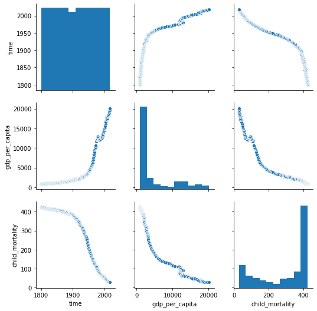
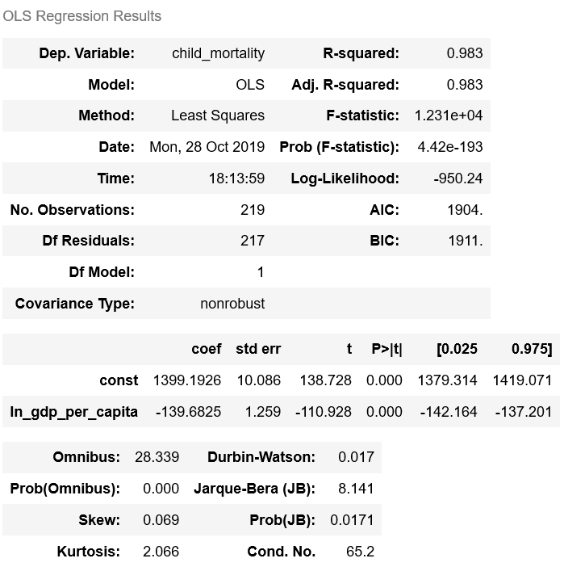

# DS-5500-HW2

## Problem 2

#### Choose and critique one of the visualization by one of your fellow classmates for HW 1 Problem 2 (distribution of income across countries and continents over time). Include a link to the original.
#### Describe the visualization and how it is similar and/or different from yours. Is it easy to interpret? Does it effectively visualize what is being asked? Why or why not?

To critique the visualization for distribution of income across countries and continents over time, I have chosen the graphs shown in the following link:
https://github.com/philip-johnson-2/ds5500-hw1/blob/master/README.md

Here, the distribution of income for a specific year is shown over a world map with a shade card of blue represting different shades of blue for different ranges of income. A slider for selecting a particular time of the year was to be implemented which would definitely make it feasible to view the changes across different years. 
This is very different from my visualization which is a line plot of income over time where each line represents a different country and all countries belonging to the same continent have the same line colour. On hovering over a line, the specific details of the income, year, country and continent can be viewed. However, it is not possible to get the country/continent names without hovering, which is much more convenient in the above (Johnson's) visualization.

The graphs I have chosen to critique is easy to interpret when you need to visualize the distribution of income across continents and contries for a specific year at a time, but not across different years. It is not possible to see the change in income across countries and continents over time. Hence, it does not visualize all the aspects of the question effectively. 

## Problem 3

#### Choose and critique one of the visualization by one of your fellow classmates for HW 1 Problem 3 (relationship between income, life expectancy, and child mortality over time). Include a link to the original.
#### Describe the visualization and how it is similar and/or different from yours. Is it easy to interpret? Does it effectively visualize what is being asked? Why or why not?

To critique the visualization for distribution of income, life expectancy and child mortality within continents over time, I have chosen the graphs shown in the following link:
https://github.com/ethanyangxlg/DS5500_HW1/blob/master/DS5500_HW1.pdf

Here, income, life expectancy and child mortality were plotted in different line plots to show their relationship within continents over time. Moreover, the visualization for each continent was present in a separate graph. Therefore, total number of graphs was large.
This is similar to my visualization except for the fact that the visualziation for all continents was present in a single graph for a particular variable. So, there were just 3 graphs in m y visualization - Income over time, Child mortality over time, Life expectancy over time.

The visualization I chose to critique is easy to interpret the relationship between income, life expectancy and child mortality over time for each continent separately. It would only take a little more effort to visualize the difference in relationship of these variables across different continents as we need to look at different graphs and understand the change. Since number of continents are limited and low, we could plot all continents in a single graph to visualize the difference in income, life expectancy or child mortality at any given time (year). However, since the relationship between income, life expectancy and child mortality against time is still shown clearly, this visualization is effective in providing what has been asked for. 

## Problem 4

#### Choose and fit one or more models to quantify the relationship betweem income (GDP per capita) and life expectancy over time. Justify your choice of model and comment on its appropriateness. (You are not required to handle the autocorrelation of time series, but should comment on how this impacts your analysis.) 
#### Visualize the model(s) and comment on what they tell you about the relationship between income and life expectancy over time.

These are the correlations between the different variables : gdp_per_capita, life_expectancy and time:

There is no linear relationship between gdp_per_capita and time, but there is a slight positive correlation between life_expectancy and time. Nevertheless, gdp_per_capita and life_expectancy were fitted in a Linear Regression model to observe a baseline. This is shown in the figure below:

Regression of life_expectancy over gdp_per_capita (Baseline):

The above baseline model gave an R-squared of just 0.336 which indicated that the model does not explain well the variability of the respone data around its mean. Since this relationship looks logarithmic, log transformation was done over gdp_per_capita. The regression plot of life_expectancy over log(gdp_per_capita) is shown below:

Regression of life_expectancy over log(gdp_per_capita):

This shows a better fit of the model with a positive correlation between life_expectancy and log(gdp_per_capita). The relationship between life_expectancy and gdp_per_capita over time explains that as gdp_per_capita increases, the life_expectancy rate increases. This is an expected observation and is thus shown in the above results. With higher gdp, better health facilities can be provided to the citizens and in turn help increase their lifespan.
The statistics of the regression model is shown below:

The R-squared of the new model has increased to 0.681 which indicated that the model explains the variability of the response data around its mean better than previously. Further transormations might help fit the data better, but there are chance that it would also lead to overfitting.

## Problem 5

#### Choose and fit one or more models to quantify the relationship betweem income (GDP per capita) and child mortality over time. Justify your choice of model and comment on its appropriateness. (You are not required to handle the autocorrelation of time series, but should comment on how this impacts your analysis.) 
#### Visualize the model(s) and comment on what they tell you about the relationship between income and child mortality over time.

These are the correlations between the different variables : gdp_per_capita, child_mortality and time:

There is no linear relationship between gdp_per_capita and time, but there is a negative correlation between child_mortality and time. Nevertheless, gdp_per_capita and child_mortality were fitted in a Linear Regression model to observe a baseline. This is shown in the figure below:

Regression of child_mortality over gdp_per_capita (Baseline):

The above baseline model gave an R-squared of just 0.264 which indicates that the model does not explain well the variability of the respone data around its mean. Since this relationship looks logarithmic, log transformation was done over gdp_per_capita. The regression plot of child_mortality over log(gdp_per_capita) is shown below:

Regression of child_mortality over log(gdp_per_capita):

The above plot does not display a very distinct correlation between the variables and requires further transformation. Therefore, log(child_mortality) was also taken to observe a better relationship between the variables.

Regression of log(child_mortality) over log(gdp_per_capita):

This shows a better fit of the model with a negative correlation between log(child_mortality) and log(gdp_per_capita). The statistics of the regression model is shown below:

The R-squared of the new model has increased to 0.708 which indicates a better representation of the model. 
The relationship between child mortality and gdp_per_capita over time explains that as gdp_per_capita increases, the child death rate reduces. This is an expected observation and is thus shown in the above results. With high gdp_per_capita, the government can provide better care and facilities for children which would help in healthy lifestyles and low death rates.
